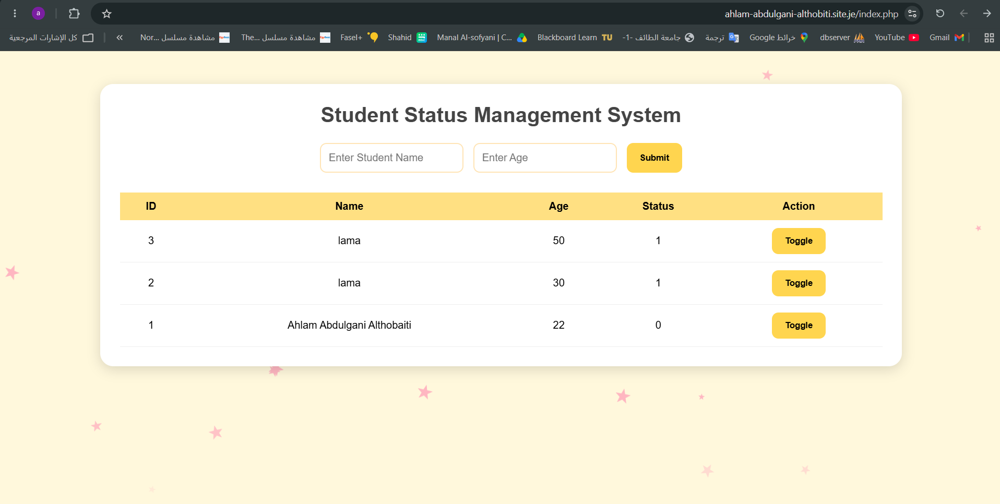
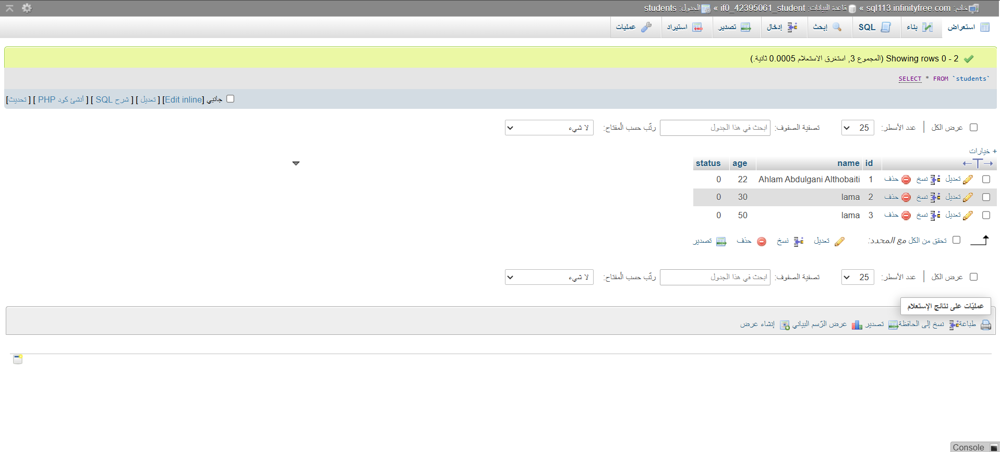

# Student Status Management System

## Project Overview

The **Student Status Management System** is a simple web application developed using **HTML, CSS, JavaScript (Fetch API), PHP, and MySQL**. The system allows users to add student records, store them in a MySQL database, display all records in a table, and toggle each student's status between **0** and **1** without reloading the page using the JavaScript Fetch API.

This project demonstrates the integration between a web interface, server-side scripting, database management, and asynchronous communication using PHP, MySQL, and JavaScript.

---

# Project Objectives

- Build a dynamic web application using PHP.
- Connect the website to a MySQL database.
- Store submitted student information.
- Display all stored records.
- Toggle the status value between **0** and **1**.
- Update the student's status instantly without reloading the page using the JavaScript Fetch API.

---

# Technologies Used

- HTML
- CSS
- JavaScript (Fetch API)
- PHP
- MySQL
- phpMyAdmin
- XAMPP
- InfinityFree
- Visual Studio Code
- W3Schools

---

# Project Structure

```text
StudentStatus/
│── DatabaseTable.png
│── README.md
│── WebpageInterface.png
│── db.php
│── demo.mp4
│── index.php
│── insert.php
│── script.js
│── style.css
└── toggle.php
```

---

# File Description

## db.php

This file creates the connection between the PHP application and the MySQL database.

**Responsibilities:**

- Connect to the MySQL database.
- Select the project database.
- Display an error message if the connection fails.

---

## index.php

This is the main page of the project.

**Features:**

- Displays the student registration form.
- Allows the user to enter the student's name and age.
- Displays all student records from the database.
- Shows the current status of each student.
- Provides a **Toggle** button for every student.
- Updates the student's status instantly using the JavaScript Fetch API.

---

## insert.php

This file receives the submitted form data.

**Responsibilities:**

- Read the student's name and age.
- Insert the data into the **students** table.
- Set the default status to **0**.
- Redirect back to the main page after adding a new record.

---

## toggle.php

This file updates the student's status.

**Responsibilities:**

- Receive the student's ID.
- Toggle the status value between **0** and **1**.
- Return the updated status to the webpage using the JavaScript Fetch API without reloading the page.

---

## style.css

Responsible for the website appearance.

**Includes:**

- Butter Yellow and White color theme.
- Responsive page layout.
- Table styling.
- Button styling.
- Input field styling.
- Animated Baby Pink stars background.

---

## script.js

Provides client-side functionality.

**Responsibilities:**

- Validate the form before submission.
- Send Toggle requests using the JavaScript Fetch API.
- Update the student's status instantly without reloading the page.
- Generate animated Baby Pink stars in the background.

---

# Database

## Database Name

```text
student_db (Local XAMPP)

if0_42395061_student (InfinityFree)
```

## Table Name

```text
students
```

## Table Structure

| Column | Type |
|---------|------|
| id | INT (Primary Key) |
| name | VARCHAR(100) |
| age | INT |
| status | TINYINT |

---

# System Workflow

1. The user enters the student's name.
2. The user enters the student's age.
3. The user clicks the **Submit** button.
4. PHP stores the submitted information in the MySQL database.
5. All student records are displayed in the table.
6. The user clicks the **Toggle** button.
7. The student's status is updated instantly using the JavaScript Fetch API without reloading the page.

---

# Project Screenshots

## Website Interface



---

## Database Table



---

# Project Demonstration

This video demonstrates the main features of the Student Status Management System, including adding students, displaying records, and updating the status using the Toggle button.

[Watch Demonstration Video](./demo.mp4)

---

# Website Link

The project is deployed on **InfinityFree**.

Website URL:

https://ahlam-abdulgani-althobiti.site.je/index.php

---

# How to Run the Project

## Running Locally (XAMPP)

1. Install XAMPP.
2. Start Apache and MySQL.
3. Copy the project folder into:

```text
C:\xampp\htdocs\
```

4. Open phpMyAdmin.
5. Create a database named:

```text
student_db
```

6. Create a table named **students**.

7. Open your browser and visit:

```text
http://localhost/StudentStatus/
```

---

## Running Online (InfinityFree)

1. Create a hosting account on InfinityFree.
2. Create a MySQL database.
3. Update the database credentials in **db.php**.
4. Upload all project files using the InfinityFree File Manager.
5. Open your website using your InfinityFree domain.

---

# Learning Resources

The following learning resource was used during the development of this project:

- W3Schools (HTML, CSS, JavaScript, PHP)

---

# Skills Gained

Through this project, I learned how to:

- Build dynamic web applications using PHP.
- Connect PHP with MySQL databases.
- Store and retrieve data.
- Perform CRUD-related operations.
- Use the JavaScript Fetch API to update data without reloading the page.
- Validate forms using JavaScript.
- Design web interfaces using CSS.
- Deploy PHP projects using InfinityFree.
- Test web applications locally using XAMPP.
- Organize project files.
- Publish projects on GitHub.
- Use W3Schools as a learning resource for web development.

---

